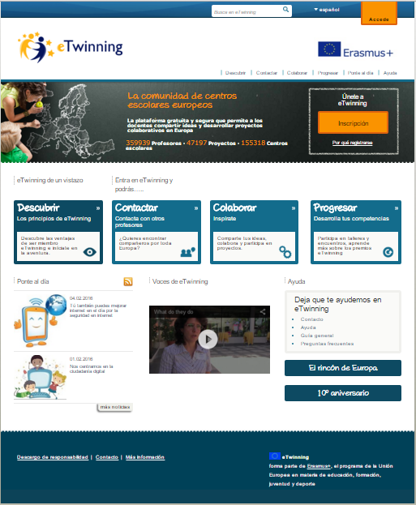
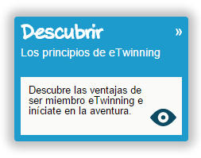
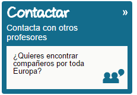
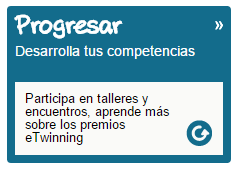

# El portal eTwinning.

El[ portal público de eTwinning ](https://www.etwinning.net/es/pub/index.htm)es el primer contacto que tenemos con el mundo eTwinning y sirve de punto de unión de unos 360.000 docentes europeos.

Imagen tomada: [Portal eTwinning](https://www.etwinning.net/es/pub/index.htm)

Entre los aspectos más destacables de este portal encontramos:

## [Descubrir:](https://www.etwinning.net/es/pub/discover.htm)

 ¿Sabes cuáles son las ventajas de ser miembro e inciarte en la aventura eTwinning?

Imagen tomada [Portal eTwinning](https://www.etwinning.net/es/pub/index.htm)

En este apartado del portal te contamos todo lo que necesitar saber para comenzar. Puedes convertirte en un eTwinner en [cuatro sencillos pasos](https://www.etwinning.net/es/pub/discover/how_to_get_involved.htm).

Existe una [recopilación de publicaciones](https://www.etwinning.net/es/pub/discover/publications.htm) realizadas para mostrarte cómo conseguirlo, ayudándote, además, a conocer más y contrastar la información viendo diferentes puntos de vista. Todas las publicaciones se encuentran en formato pdf y son descargables en diferentes idiomas.

Hay mucha gente que ya ha puesto en práctica diferentes proyectos y que aconseja poniendo [voz a su experiencia](https://www.etwinning.net/es/pub/discover/people_say.htm) o a su relación con eTwinning y sus beneficios: desde autoridades políticas, miembros de los servicios nacionales de apoyo y docentes.

## [Contactar:](https://www.etwinning.net/es/pub/connect.htm)

Una de las mejores maneras de comenzar es ver, disfrutar y aprender de diferentes proyectos ya realizados. 

Imagen tomada [Portal eTwinning](https://www.etwinning.net/es/pub/index.htm)

En el siguiente apartado podrás [conocer y entrar en contacto](https://www.etwinning.net/es/pub/connect/browse_people_schools_and_pro.htm) con diferentes docentes, proyectos, colegios y realizar la búsqueda de los mismos por diferentes aspectos: edad, lugar, país, materias,...

## [Colaborar:](https://www.etwinning.net/es/pub/collaborate.htm)

Si necesitas inspiración para crear y diseñar, este apartado puede ayudarte mucho. 

Imagen tomada [Portal eTwinning](https://www.etwinning.net/es/pub/index.htm)

eTwinning nos ofrece numerosos [kits](https://www.etwinning.net/es/pub/collaborate/kits.cfm) que guiarán nuestros inicios hacia el éxito en el diseño e implementación de los proyectos; también existen [módulos](https://www.etwinning.net/es/pub/collaborate/modules.htm) que podemos incorporar a nuestros diseños. 

En la galería de proyectos podremos encontrar grandes ejemplos de proyectos que se han diseñado e implementado. Todos ellos han sido designados como Buenas Prácticas, por lo tanto serán buenos “espejos” para que nuestros proyectos sean grandes eventos de colaboración y aprendizaje en nuestras aulas.

## [Progresar:](https://www.etwinning.net/es/pub/progress.htm)

eTwinning quiere ayudarte a que puedas formarte  y conocer sus herramientas y posibilidades. 

Imagen tomada [Portal eTwinning](https://www.etwinning.net/es/pub/index.htm)

De forma periódica, y de forma variada, el portal ofrece oportunidades de formación y desarrollo profesional a los docentes:

* Talleres: ayudan a conocer más eTwinning y la colaboración europea.

* Encuentros didácticos: eventos cortos, pero intensos, centrados en algún tema y dirigidos por un experto. Son virtuales, cortos e intensivos, promoviendo el debate entre profesores europeos. 

* Grupos eTwinning: son grupos privados y cerrados en los que los docentes debaten de forma abierta sobre un tema en concreto. Cada usuario puede crear los suyos propios.

El portal nos abre la puerta al siguiente paso y a la siguiente plataforma, [eTwinning live](https://live.etwinning.net/unauthorized). Para el uso de esta parte tendremos que registrarnos.  

Imagen tomada [Portal eTwinning](https://www.etwinning.net/es/pub/index.htm)

 
